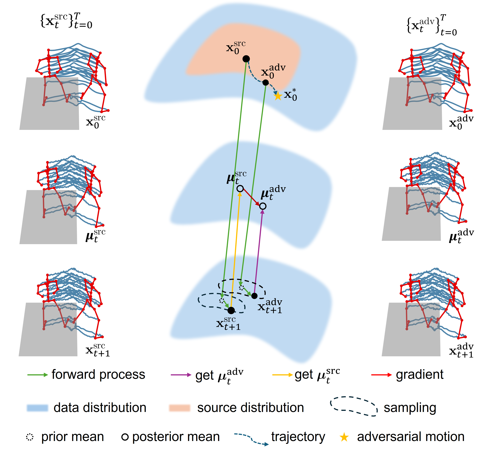

# Quality-Preserving Imperceptible Adversarial Attack on Skeleton-based Human Action Recognition

Code for the paper "Quality-Preserving Imperceptible Adversarial Attack on Skeleton-based Human Action Recognition"

## Environment Setup
Please create an appropriate environment using conda: 

> conda env create -f environment.yml

> conda activate QPAttack

## Download Data
100STYLE dataset can be downloaded from [100STYLE](https://www.ianxmason.com/100style/) and HDM05 dataset can be downloaded from [HDM05](https://resources.mpi-inf.mpg.de/HDM05/). Once downloaded, please extract it into ./dataset.

Please follow the [frame-cut.csv](https://drive.google.com/uc?id=1d0VM8k4UjA4dDmaviuZMjAf-WQNLUwnZ&export=download) to segment the long sequence of motions in the 100STYLE dataset. For HDM05 dataset, we follow the pre-processing precedure in [SMART](https://github.com/realcrane/Understanding-the-Robustness-of-Skeleton-based-Action-Recognition-under-Adversarial-Attack).

## Methodology

## Results

## Online User Study (test if you can tell the adversarial motions from our method)

